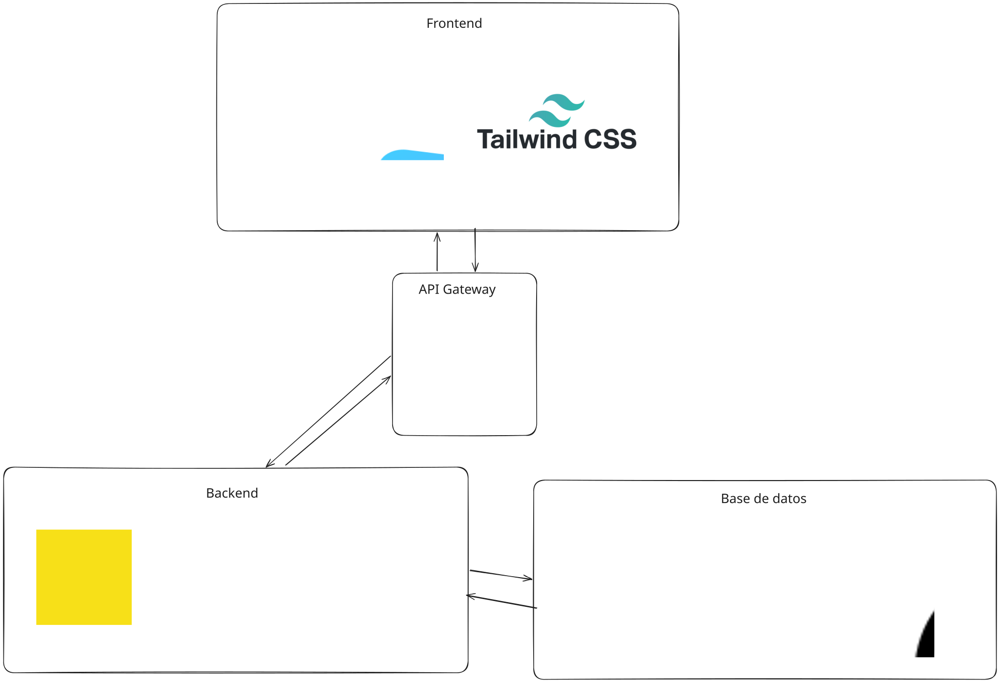

# 📌 PinBoard

<div align="center">
  <p><strong>Un clon distribuido y escalable de Pinterest basado en una arquitectura de microservicios.</strong></p>
  
  
  
  
  
  
  
</div>

---

## 📖 Descripción

**PinBoard** es un sistema distribuido construido con el objetivo de demostrar la implementación de arquitecturas modernas y escalables. La aplicación consta de múltiples microservicios independientes que se comunican de forma transparente a través de un **API Gateway (Nginx)**, y cuenta con una sólida capa de persistencia de datos respaldada por clústeres replicados tanto en bases de datos relacionales (PostgreSQL) como NoSQL (MongoDB).

Todo el sistema está contenedorizado utilizando **Docker** y orquestado mediante **Docker Compose**, lo que garantiza que los entornos de desarrollo, prueba y producción sean consistentes.

---

## 🏗️ Arquitectura del Sistema

El diseño se centra en el aislamiento de dominios de datos y la alta disponibilidad. Cada microservicio corre junto a una réplica para balanceo de carga.

### Microservicios

1. 🔐 **Auth Service (`microservicioAuth`)**: Gestión de autenticación de usuarios y generación de JWT (Node.js + PostgreSQL).
2. 👤 **Profile Service (`profile_service`)**: Gestión de perfiles de usuario (Node.js + PostgreSQL).
3. 📌 **Pin Service (`pin_service`)**: Lógica central para la creación, lectura e interacción con "Pines" (Node.js + PostgreSQL).
4. 🗂️ **Category Service (`category_service`)**: Administración de tableros y categorización de los pines (Node.js + PostgreSQL).
5. 🖼️ **Image Service (`image_service`)**: Procesamiento y almacenamiento de archivos multimedia e imágenes (Python/Flask + MongoDB).

### Bases de Datos (Alta Disponibilidad)
- **Clúster PostgreSQL**: Base de datos relacional principal configurada con 1 nodo Primario y 2 nodos Réplica (Standby) gestionando la replicación transaccional.
- **Clúster MongoDB**: Base de datos NoSQL para almacenamiento pesado (imágenes/metadatos) configurado como un *Replica Set* de 3 nodos.

### Diagramas de Arquitectura

**Arquitectura General:**
<p align="center">
  
</p>

**Arquitectura del Backend:**
<p align="center">
  
</p>

---

## 🛠️ Tecnologías Utilizadas

| Categoría | Tecnología | Uso en el proyecto |
| :--- | :--- | :--- |
| **Backend** | `Node.js` (Express) | Runtime de microservicios transaccionales. |
| **Backend** | `Python 3.9` | Servicio especializado en manejo de imágenes. |
| **Base de Datos** | `PostgreSQL 16` | Persistencia relacional con replicación maestro-esclavo. |
| **Base de Datos** | `MongoDB 6.0` | Persistencia orientada a documentos para multimedia. |
| **Infraestructura** | `Docker & Compose` | Contenedorización de microservicios y bases de datos. |
| **Gateway** | `Nginx` | API Gateway, enrutamiento y balanceo de carga interno. |

---

## 📂 Estructura del Proyecto

```text
PinBoard/
├── category_service/      # Microservicio de categorías (Node.js)
├── image_service/         # Microservicio de imágenes (Python)
├── microservicioAuth/     # Microservicio de autenticación (Node.js)
├── pin_service/           # Microservicio de Pines (Node.js)
├── profile_service/       # Microservicio de perfiles (Node.js)
├── nginx/                 # Configuración de Nginx como Reverse Proxy / API Gateway
├── scripts/               # Scripts de inicialización y utilidades de Base de Datos
├── .env                   # Variables de entorno principales
├── docker-compose.yml     # Orquestación de toda la infraestructura
└── README.md              # Documentación técnica
```

---

## 🚀 Instalación y Despliegue Local

### Pre-requisitos
Asegúrate de tener instalados en tu sistema local:
- [Docker](https://docs.docker.com/get-docker/)
- [Docker Compose](https://docs.docker.com/compose/install/)

### Pasos para iniciar el entorno

1. **Clonar el repositorio:**
   ```bash
   git clone <url-del-repositorio>
   cd PinBoard
   ```

2. **Configurar las variables de entorno:**
   Asegúrate de tener el archivo `.env` configurado en la raíz del proyecto. Las variables incluyen credenciales de bases de datos, URIs y el `JWT_SECRET`.

3. **Otorgar permisos (si es necesario en Linux):**
   Asegúrate de que el archivo de llaves de MongoDB (`mongo-keyfile`) tenga los permisos correctos.
   ```bash
   chmod 400 mongo-keyfile
   ```

4. **Levantar la infraestructura con Docker Compose:**
   ```bash
   docker-compose up --build -d
   ```
   *Nota: La primera ejecución tomará unos minutos mientras descarga las imágenes de Postgres, Mongo, Node y Python, y construye los microservicios locales.*

5. **Verificar los servicios:**
   Todos los microservicios se agrupan detrás del contenedor Nginx expuesto en el puerto `80`.
   Para revisar los logs en tiempo real:
   ```bash
   docker-compose logs -f
   ```

---

## 🤝 Cómo Contribuir

¡Las contribuciones son bienvenidas! Para mantener la calidad del código y la coherencia del proyecto, te pedimos que:

1. Consultes nuestro archivo [CONTRIBUTING.md](CONTRIBUTING.md) para conocer nuestro flujo de trabajo, convenciones de ramas y reglas de nombramiento para los commits (Commits Semánticos).
2. Hagas un fork del repositorio.
3. Creés una rama para tu feature o corrección (`git checkout -b feature/MiNuevaCaracteristica`).
4. Realices un Pull Request detallando los cambios.

---

<div align="center">
  <p>Construido con ❤️ para la materia de Sistemas Distribuidos.</p>
</div>